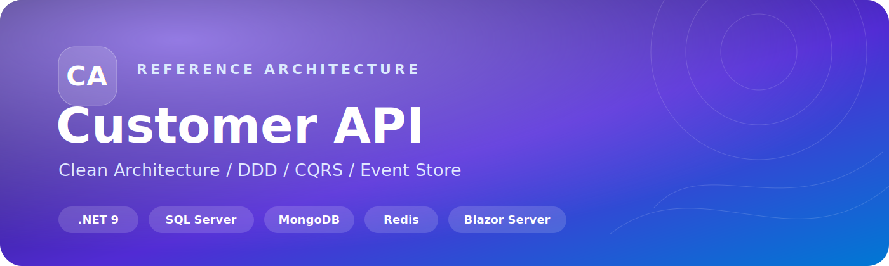
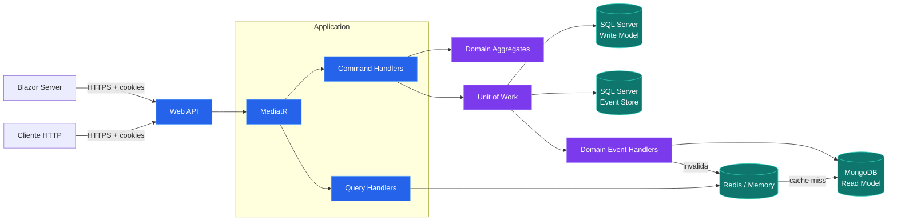
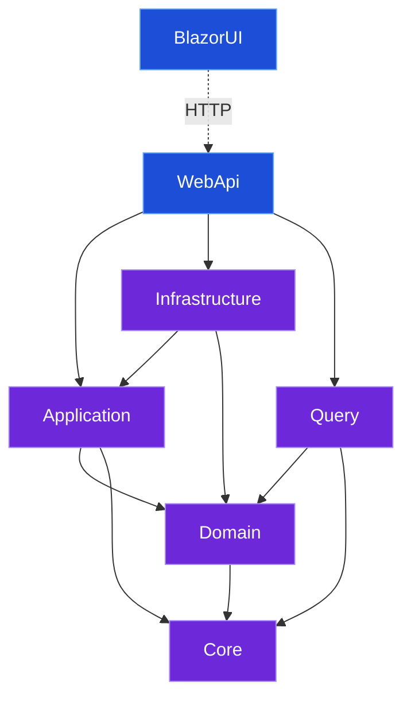
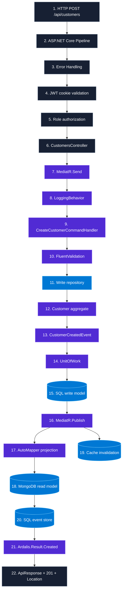
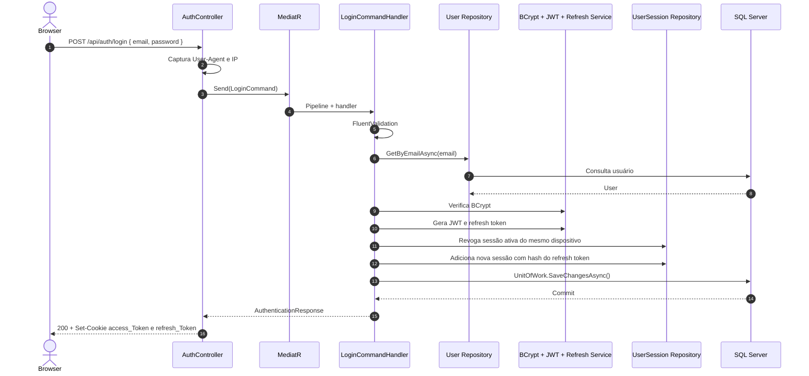
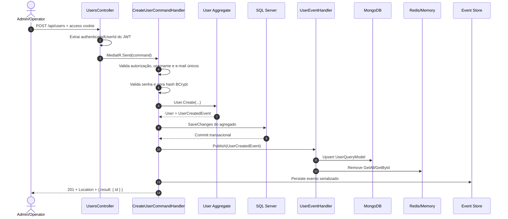
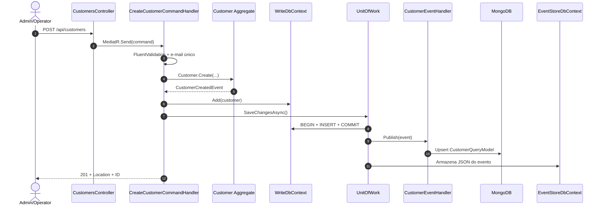
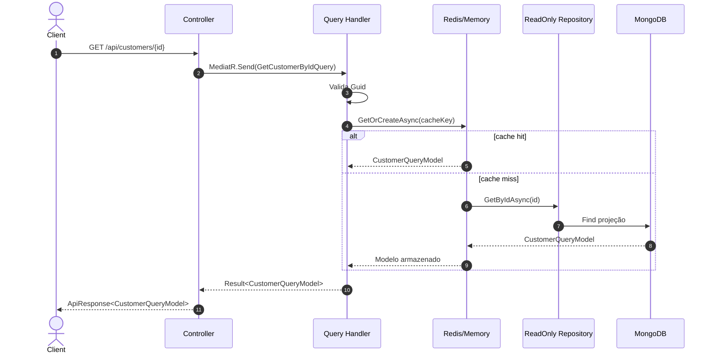
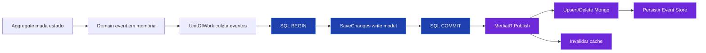
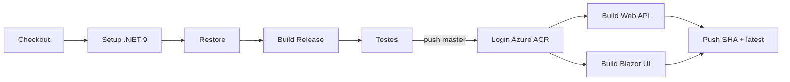

<div align="center">



<p>
  
  
  
  
  
  
</p>

<p>
  Uma API de gestão de usuários e clientes construída para demonstrar separação entre escrita e leitura,
  agregados ricos, eventos de domínio, projeções, autenticação segura e observabilidade.
</p>

[Comece aqui](#mapa-da-documentação) · [Arquitetura](#arquitetura) · [Request por arquivo](#anatomia-completa-de-uma-request) · [Pacotes por camada](#pacotes-por-projeto) · [API](#referência-da-api)

</div>

---

## Visão geral

O **Customer API** separa o modelo transacional do modelo de consulta:

- comandos de usuários, clientes, conta e autenticação passam pelo **MediatR** e alteram agregados no **SQL Server**;
- os agregados produzem eventos de domínio, persistidos em um **Event Store** relacional;
- handlers de eventos mantêm projeções otimizadas no **MongoDB**;
- queries consultam exclusivamente as projeções e usam **Redis** ou cache em memória;
- uma aplicação **Blazor Server** consome a Web API e oferece as telas de autenticação e gestão;
- JWT e refresh token são enviados em cookies `HttpOnly`, `Secure` e `SameSite=Lax`.

> [!IMPORTANT]
> O projeto implementa um event store auditável e projeções orientadas por eventos. O estado atual dos agregados também é persistido no SQL Server; atualmente eles não são reidratados exclusivamente pelo histórico de eventos.

### O projeto em seis blocos

<table>
<tr>
<td width="33%" valign="top"><strong>01 · Domain</strong><br/><sub>Agregados, invariantes, value objects e eventos. Não conhece HTTP, EF Core ou MongoDB.</sub></td>
<td width="33%" valign="top"><strong>02 · Application</strong><br/><sub>Casos de uso de escrita, autenticação, validators e portas para infraestrutura.</sub></td>
<td width="33%" valign="top"><strong>03 · Infrastructure</strong><br/><sub>SQL Server, repositórios, Unit of Work, JWT, BCrypt, refresh token e cache.</sub></td>
</tr>
<tr>
<td width="33%" valign="top"><strong>04 · Query</strong><br/><sub>Read models MongoDB, projeções de eventos, cache e handlers de consulta.</sub></td>
<td width="33%" valign="top"><strong>05 · Web API</strong><br/><sub>Controllers, cookies, autorização, middleware, OpenAPI e composition root.</sub></td>
<td width="33%" valign="top"><strong>06 · Blazor UI</strong><br/><sub>Experiência administrativa, autenticação web e clientes HTTP tipados.</sub></td>
</tr>
</table>

## Mapa da documentação

| Quero entender... | Vá para |
|---|---|
| como uma chamada atravessa cada arquivo | [Anatomia completa de uma request](#anatomia-completa-de-uma-request) |
| por que cada NuGet existe em cada camada | [Pacotes por projeto](#pacotes-por-projeto) |
| como command, evento e query se conectam | [Fluxos ponta a ponta](#fluxos-ponta-a-ponta) |
| onde cada responsabilidade está no código | [Catálogo de arquivos por camada](#catálogo-de-arquivos-por-camada) |
| todas as rotas, bodies, respostas e roles | [Referência da API](#referência-da-api) |
| como subir bancos, API e UI | [Executando o projeto](#executando-o-projeto) |
| decisões, riscos e próximos passos técnicos | [Decisões e limites atuais](#decisões-e-limites-atuais) |

## Sumário

- [Recursos](#recursos)
- [Tecnologias](#tecnologias)
- [Pacotes por projeto](#pacotes-por-projeto)
- [Arquitetura](#arquitetura)
- [Estrutura da solução](#estrutura-da-solução)
- [Catálogo de arquivos por camada](#catálogo-de-arquivos-por-camada)
- [Modelo de domínio](#modelo-de-domínio)
- [Anatomia completa de uma request](#anatomia-completa-de-uma-request)
- [Fluxos ponta a ponta](#fluxos-ponta-a-ponta)
- [Referência da API](#referência-da-api)
- [Autenticação e autorização](#autenticação-e-autorização)
- [Modelo de respostas](#modelo-de-respostas)
- [Executando o projeto](#executando-o-projeto)
- [Configuração](#configuração)
- [Interface Blazor](#interface-blazor)
- [Observabilidade](#observabilidade)
- [Testes](#testes)
- [CI/CD](#cicd)

## Recursos

- cadastro, atualização, remoção e consulta de clientes;
- gestão de usuários, perfis e papéis de acesso;
- troca de e-mail e senha da própria conta;
- login com JWT, sessões por dispositivo e refresh token rotativo;
- detecção de reutilização de refresh token revogado;
- CQRS com bancos independentes para escrita e leitura;
- eventos de domínio e trilha histórica no event store;
- invalidação automática do cache após alterações;
- migrations e criação das coleções/índices no startup;
- seed opcional do primeiro administrador;
- OpenAPI com Scalar, health checks, correlation ID e MiniProfiler;
- interface administrativa responsiva em Blazor Server.

## Tecnologias

| Área | Tecnologia | Responsabilidade |
|---|---|---|
| Runtime | .NET 9 / C# | Plataforma e linguagem |
| API | ASP.NET Core Controllers | Pipeline HTTP e endpoints REST |
| UI | Blazor Server + Bootstrap | Interface web interativa |
| Mensageria interna | MediatR | Commands, queries, pipeline e eventos |
| Validação | FluentValidation | Validação dos contratos de aplicação |
| Resultado | Ardalis.Result | Resultados tipados e estados de erro |
| Mapeamento | AutoMapper | Eventos para query models |
| Escrita | EF Core + SQL Server | Agregados e sessões |
| Eventos | EF Core + SQL Server | Histórico serializado de eventos |
| Leitura | MongoDB Driver | Projeções desnormalizadas |
| Cache | Redis / MemoryCache | Cache das queries |
| Segurança | JWT Bearer + BCrypt | Autenticação, autorização e senha |
| Resiliência | Polly | Retry exponencial nas projeções MongoDB |
| Documentação | OpenAPI + Scalar | Contrato navegável da API |
| Observabilidade | Health Checks, MiniProfiler, CorrelationId | Saúde, desempenho e rastreabilidade |
| Testes | xUnit, NSubstitute, FluentAssertions, SQLite | Testes unitários e de integração |
| Entrega | Docker, Compose, GitHub Actions, ACR | Build, testes e imagens |

## Pacotes por projeto

As versões são centralizadas em `Directory.Packages.props`. Os `.csproj` declaram apenas quais pacotes cada projeto realmente consome. Essa separação deixa upgrades previsíveis e evita versões divergentes entre camadas.

### `CustomerApi.Core`

O Core reúne contratos e utilitários compartilhados. Ele não implementa banco ou regra de negócio específica.

| Pacote | Versão | Por que está aqui |
|---|---:|---|
| `MediatR` | 14.1.0 | `BaseEvent` implementa a abstração de notificação compartilhada pelas camadas. |
| `Microsoft.Extensions.Configuration` | 10.0.8 | Base das extensões de leitura das seções de configuração. |
| `Microsoft.Extensions.Configuration.Abstractions` | 10.0.8 | Permite depender de `IConfiguration` sem hospedar uma aplicação. |
| `Microsoft.Extensions.DependencyInjection` | 10.0.8 | Suporte às extensões de registro de options e serviços comuns. |
| `Microsoft.Extensions.DependencyInjection.Abstractions` | 10.0.8 | Contratos de DI consumidos por extensions methods. |
| `Microsoft.Extensions.Hosting` | 10.0.8 | Integração dos utilitários com o host .NET. |
| `Microsoft.Extensions.Hosting.Abstractions` | 10.0.8 | Contratos de ambiente e ciclo de vida do host. |
| `Microsoft.Extensions.Http` | 10.0.8 | Infraestrutura compartilhada para `HttpClient`. |
| `Microsoft.Extensions.Logging.Abstractions` | 10.0.8 | Contratos de logging sem acoplar a um provider. |
| `Microsoft.Extensions.Options` | 10.0.8 | Modelo tipado de `JwtOptions`, `CacheOptions`, `ConnectionOptions` e `AdminSeedOptions`. |
| `Microsoft.Extensions.Options.ConfigurationExtensions` | 10.0.8 | Faz bind das seções de configuração nas options. |
| `Microsoft.Extensions.Options.DataAnnotations` | 10.0.8 | Valida options com Data Annotations no startup. |
| `Microsoft.Extensions.Primitives` | 10.0.8 | Tipos primitivos usados pelo ecossistema de configuração/HTTP. |
| `System.Configuration.ConfigurationManager` | 10.0.8 | Compatibilidade de configuração exigida pelos utilitários compartilhados. |
| `System.Text.Json` | 10.0.8 | Serialização camelCase de eventos, respostas e helpers `ToJson`/`FromJson`. |

### `CustomerApi.Domain`

| Dependência | Tipo | Por que está aqui |
|---|---|---|
| `CustomerApi.Core` | Project reference | Reutiliza `BaseEntity`, `BaseEvent`, `IAggregateRoot` e contratos de repositório. |

O Domain não referencia pacotes NuGet diretamente. Essa é a camada mais protegida: agregados, value objects e invariantes permanecem independentes de persistência, UI e transporte.

### `CustomerApi.Application`

| Pacote | Versão | Por que está aqui |
|---|---:|---|
| `Ardalis.Result` | 10.1.0 | Representa `Success`, `Created`, `Invalid`, `Unauthorized`, `Forbidden` e `NotFound` sem lançar exceção para fluxo esperado. |
| `Ardalis.Result.FluentValidation` | 10.1.0 | Converte falhas do FluentValidation para `Result.Invalid`. |
| `FluentValidation` | 12.1.1 | Define validators de commands de auth, account, users e customers. |
| `FluentValidation.DependencyInjectionExtensions` | 12.1.1 | Descobre e registra validators no container. |
| `MediatR` | 14.1.0 | Define commands como `IRequest`, handlers e o `LoggingBehavior`. |
| `Microsoft.Extensions.DependencyInjection.Abstractions` | 10.0.8 | Expõe `AddCommandHandlers` sem depender do host Web. |

**Referências internas:** `Core` fornece portas e tipos base; `Domain` fornece agregados, value objects, eventos e interfaces específicas dos repositórios.

### `CustomerApi.Infrastructure`

| Pacote | Versão | Por que está aqui |
|---|---:|---|
| `BCrypt.Net-Next` | 4.2.0 | Hash e verificação de senha em `BCryptPasswordHasher`. |
| `MediatR` | 14.1.0 | O `UnitOfWork` publica os eventos de domínio depois do commit. |
| `Microsoft.EntityFrameworkCore` | 9.0.16 | Implementa DbContexts, mappings, change tracking e repositórios. |
| `Microsoft.EntityFrameworkCore.Analyzers` | 9.0.16 | Detecta padrões problemáticos de EF Core durante a compilação. |
| `Microsoft.EntityFrameworkCore.Relational` | 9.0.16 | Fornece transações, migrations e recursos comuns a bancos relacionais. |
| `Microsoft.Extensions.DependencyInjection.Abstractions` | 10.0.8 | Registra implementações de infraestrutura sem conhecer a Web API. |
| `Microsoft.Extensions.Identity.Core` | 9.0.16 | Primitivos de segurança/identidade usados pela infraestrutura. |
| `Microsoft.Extensions.Logging.Abstractions` | 10.0.8 | Logging do Unit of Work, JWT e persistência. |
| `MongoDB.Bson` | 3.8.1 | Representação BSON disponível às integrações de dados. |
| `MongoDB.Driver` | 3.8.1 | Driver compartilhado com os componentes de persistência NoSQL. |
| `Polly` | 8.6.6 | Primitivos de resiliência disponíveis à infraestrutura. |
| `System.IdentityModel.Tokens.Jwt` | 8.18.0 | Cria access tokens e claims em `JwtTokenGenerator`. |

**Referências internas:** `Application` contém as interfaces `IJwtTokenGenerator`, `IPasswordHasher` e `IRefreshTokenService`; `Domain` contém agregados/repositórios; `Core` contém `IUnitOfWork`, cache e event store.

### `CustomerApi.Query`

| Pacote | Versão | Por que está aqui |
|---|---:|---|
| `Ardalis.Result` | 10.1.0 | Retorna query models tipados, `NotFound` e demais estados. |
| `Ardalis.Result.FluentValidation` | 10.1.0 | Traduz validações de IDs para o modelo de resultado. |
| `AutoMapper` | 16.1.1 | Converte eventos `User*`/`Customer*` em query models. |
| `FluentValidation` | 12.1.1 | Valida queries `GetById`. |
| `FluentValidation.DependencyInjectionExtensions` | 12.1.1 | Registra os query validators. |
| `MediatR` | 14.1.0 | Executa queries e recebe notificações dos domain events. |
| `Microsoft.Extensions.DependencyInjection.Abstractions` | 10.0.8 | Expõe extensões de registro do read side. |
| `MongoDB.Bson` | 3.8.1 | Configura Guid, enums e convenções BSON das projeções. |
| `MongoDB.Driver` | 3.8.1 | Cria coleções, índices, filtros, upserts e consultas. |
| `Polly` | 8.6.6 | Duas retentativas exponenciais com jitter para operações MongoDB. |

**Referências internas:** `Domain` é necessário porque os projection handlers recebem seus eventos; `Core` fornece eventos base e `ICacheService`.

### `CustomerApi.WebApi`

| Pacote | Versão | Por que está aqui |
|---|---:|---|
| `Ardalis.Result` | 10.1.0 | `ResultExtensions` traduz o resultado da aplicação em status/envelope HTTP. |
| `Asp.Versioning.Mvc` | 8.1.1 | Declara a API v1 e assume a versão padrão quando omitida. |
| `Asp.Versioning.Mvc.ApiExplorer` | 8.1.1 | Expõe versões ao explorer/OpenAPI. |
| `AspNetCore.HealthChecks.MongoDb` | 9.0.0 | Verifica disponibilidade do read model. |
| `AspNetCore.HealthChecks.Redis` | 9.0.0 | Verifica o cache distribuído. |
| `AspNetCore.HealthChecks.UI.Client` | 9.0.0 | Serializa `/health` no formato detalhado da Health Checks UI. |
| `AutoMapper` | 16.1.1 | Validação dos profiles no startup e composição da projeção. |
| `CorrelationId` | 3.0.1 | Propaga um identificador por request nos logs. |
| `MediatR` | 14.1.0 | Controllers enviam commands e queries sem conhecer os handlers. |
| `Microsoft.AspNetCore.Authentication.JwtBearer` | 9.0.16 | Valida o JWT lido do cookie `access_Token`. |
| `Microsoft.AspNetCore.OpenApi` | 9.0.15 | Produz `/openapi/v1.json`. |
| `Microsoft.EntityFrameworkCore` | 9.0.16 | Integra DbContexts e health checks ao host. |
| `Microsoft.EntityFrameworkCore.Design` | 9.0.16 | Ferramentas de design usadas para gerar migrations; não vira dependência transitiva. |
| `Microsoft.EntityFrameworkCore.InMemory` | 9.0.16 | Provider disponível para cenários de teste. |
| `Microsoft.EntityFrameworkCore.SqlServer` | 9.0.16 | Provider real do write model e event store. |
| `Microsoft.EntityFrameworkCore.Tools` | 9.0.16 | Comandos de migration; marcado como asset privado. |
| `Microsoft.Extensions.Caching.StackExchangeRedis` | 9.0.16 | Implementa `IDistributedCache` sobre Redis. |
| `Microsoft.Extensions.Diagnostics.HealthChecks` | 9.0.16 | Infraestrutura do endpoint `/health`. |
| `Microsoft.Extensions.Diagnostics.HealthChecks.EntityFrameworkCore` | 9.0.16 | Executa checks dos DbContexts SQL. |
| `Microsoft.VisualStudio.Azure.Containers.Tools.Targets` | 1.23.0 | Integra debugging/build de container no Visual Studio. |
| `MiniProfiler.AspNetCore.Mvc` | 4.5.4 | Mede requests MVC e publica `Server-Timing`. |
| `MiniProfiler.EntityFrameworkCore` | 4.5.4 | Captura operações EF Core no profiler. |
| `Scalar.AspNetCore` | 2.14.14 | Interface visual dark para a especificação OpenAPI. |
| `System.Text.RegularExpressions` | 4.3.1 | Suporte às validações e utilitários baseados em regex. |
| `UAParser` | 3.1.47 | Interpreta o `User-Agent` usado na identificação da sessão. |

**Referências internas:** esta é a composition root e referencia `Application`, `Infrastructure` e `Query`.

### `CustomerApi.BlazorUI`

| Pacote | Versão | Por que está aqui |
|---|---:|---|
| `FluentValidation` | 12.1.1 | Valida formulários antes de enviar requests à API. |
| `FluentValidation.DependencyInjectionExtensions` | 12.1.1 | Registra validators da UI. |
| `Microsoft.AspNetCore.Components.Authorization` | 9.0.16 | `AuthorizeRouteView`, `AuthorizeView` e estado de autenticação. |
| `Microsoft.AspNetCore.WebUtilities` | 9.0.16 | Utilitários HTTP/web usados no fluxo de navegação/autenticação. |
| `System.IdentityModel.Tokens.Jwt` | 8.18.0 | Lê claims do JWT recebido da API para formar a identidade da UI. |

A UI não referencia os projetos internos da API. A fronteira é HTTP, preservando a possibilidade de implantação independente.

### Projetos de teste

| Pacote | Versão | Uso |
|---|---:|---|
| `xunit` / `xunit.runner.visualstudio` | 2.9.3 / 3.1.5 | Framework e descoberta/execução dos testes. |
| `xunit.analyzers` / `xunit.categories` | 1.27.0 / 3.0.1 | Qualidade e categorização da suíte. |
| `FluentAssertions` | 8.9.0 | Assertions legíveis e expressivas. |
| `NSubstitute` | 5.3.0 | Mocks das portas da aplicação. |
| `NSubstitute.Analyzers.CSharp` | 1.0.17 | Detecta configurações inválidas de substitutes. |
| `Bogus` | 35.6.5 | Gera dados realistas para cenários de teste. |
| `coverlet.collector` / `coverlet.msbuild` | 10.0.0 | Coleta cobertura no runner e no MSBuild. |
| `Microsoft.NET.Test.Sdk` | 18.5.1 | Host de execução de testes .NET. |
| `Microsoft.Data.Sqlite.Core` / `Microsoft.EntityFrameworkCore.Sqlite` | 10.0.8 / 9.0.16 | Banco relacional in-memory com comportamento mais real que um provider puramente em memória. |
| `Microsoft.AspNetCore.Mvc.Testing` | 9.0.16 | Sobe a Web API por `WebApplicationFactory` nos testes de integração. |
| `AutoMapper` | 16.1.1 | Exercita e valida profiles de projeção. |
| `Microsoft.Extensions.Configuration.Binder` | 10.0.8 | Monta configurações tipadas nos testes das extensions de options. |

### Ferramentas de qualidade comuns

`Roslynator.Analyzers` (4.15.0), `Roslynator.CodeAnalysis.Analyzers` (4.15.0), `Roslynator.CodeFixes` (4.15.0), `Roslynator.Formatting.Analyzers` (4.15.0) e `Roslynator.Refactorings` (4.15.0) estão distribuídos pelos projetos de produção e teste. São dependências de compilação/desenvolvimento, marcadas como privadas quando apropriado; não representam componentes do fluxo de runtime.

## Arquitetura

### Visão de componentes



### Dependências entre camadas



O domínio não conhece banco, HTTP ou UI. A aplicação orquestra casos de uso por abstrações; a infraestrutura fornece as implementações. A camada Query constitui o lado de leitura do CQRS e não consulta o banco transacional.

## Estrutura da solução

```text
src/
├── CustomerApi.Core           # Contratos compartilhados, base entities/events e options
├── CustomerApi.Domain         # Agregados, value objects, enums e domain events
├── CustomerApi.Application    # Commands, validators, handlers e abstrações de autenticação
├── CustomerApi.Infrastructure # EF Core, repositórios, Unit of Work, JWT, BCrypt e cache
├── CustomerApi.Query          # Query models, handlers, MongoDB e projeções de eventos
├── CustomerApi.WebApi         # Controllers, middleware, DI, OpenAPI e startup
└── CustomerApi.BlazorUI       # UI, autenticação própria e clientes HTTP tipados
tests/
├── CustomerApi.UnitTests      # Domínio, aplicação, query e utilitários
└── CustomerApi.IntegrationTests # API real por WebApplicationFactory
```

| Projeto | Papel |
|---|---|
| `CustomerApi.Core` | Define `BaseEntity`, `BaseEvent`, `IUnitOfWork`, `ICacheService`, options e extensões comuns. |
| `CustomerApi.Domain` | Contém os agregados `User`, `Customer`, `UserSession`, value objects e eventos. |
| `CustomerApi.Application` | Implementa comandos de escrita/autenticação e seus validators e handlers. |
| `CustomerApi.Infrastructure` | Persiste o write model/event store e implementa JWT, refresh token, BCrypt e cache. |
| `CustomerApi.Query` | Projeta eventos no MongoDB e executa consultas cacheadas. |
| `CustomerApi.WebApi` | Expõe a API, converte `Result` em HTTP e compõe a aplicação. |
| `CustomerApi.BlazorUI` | Oferece a experiência web e encaminha cookies de autenticação para a API. |

## Catálogo de arquivos por camada

Esta seção funciona como um mapa de manutenção: mostra onde procurar antes de alterar uma responsabilidade.

### Core: contratos que atravessam a solução

| Caminho | Responsabilidade |
|---|---|
| `Core/SharedKernel/BaseEntity.cs` | ID da entidade, coleção e ciclo de vida dos domain events. |
| `Core/SharedKernel/BaseEvent.cs` | Contrato base de evento publicável pelo MediatR. |
| `Core/SharedKernel/EventStore.cs` | Registro serializado de um evento e seu aggregate ID. |
| `Core/SharedKernel/IUnitOfWork.cs` | Fronteira de confirmação do caso de uso. |
| `Core/SharedKernel/IEventStoreRepository.cs` | Porta de persistência da trilha de eventos. |
| `Core/SharedKernel/ICacheService.cs` | Abstrai cache local ou distribuído. |
| `Core/AppSettings/*.cs` | Contratos tipados de conexão, JWT, cache e admin seed. |
| `Core/Extensions/JsonExtensions/*.cs` | Configuração JSON camelCase, enum textual e private constructors. |
| `Core/Extensions/ServiceCollectionsExtensions/AppSettingsExtensions.cs` | Bind e validação das options no startup. |

### Domain: modelo de negócio

| Caminho | Responsabilidade |
|---|---|
| `Domain/Entities/CustomerAggregate/Customer.cs` | Agregado Customer e operações `Create`, `ChangeEmail`, `Delete`. |
| `Domain/Entities/CustomerAggregate/Events/*.cs` | Fatos de criação, alteração e exclusão do cliente. |
| `Domain/Entities/CustomerAggregate/ICustomerWriteOnlyRepository.cs` | Porta de escrita específica do agregado. |
| `Domain/Entities/UserAggregate/User.cs` | Agregado User, role, perfil, senha e estado ativo. |
| `Domain/Entities/UserAggregate/Events/*.cs` | Fatos de ciclo de vida do usuário. |
| `Domain/Entities/UserSessionAggregate/UserSession.cs` | Sessão, fingerprint, expiração, rotação e revogação. |
| `Domain/ValueObjects/Email.cs` | Invariante e representação de e-mail. |
| `Domain/ValueObjects/Password.cs` | Regras para senha em texto antes do hash. |
| `Domain/ValueObjects/UserProfile.cs` | Nome, nascimento e cargo tratados como unidade. |
| `Domain/Exceptions/DomainException.cs` | Falha de invariante convertida em HTTP 400 no limite da API. |

### Application: casos de uso de escrita

| Pasta/arquivo | Responsabilidade |
|---|---|
| `Application/**/Commands/*Command.cs` | Contrato do caso de uso enviado ao MediatR. |
| `Application/**/Commands/*Validator.cs` | Regras sintáticas e pré-condições do command. |
| `Application/**/Handlers/*Handler.cs` | Orquestra validação, repositórios, domínio e Unit of Work. |
| `Application/**/Responses/*.cs` | Retorno público tipado do caso de uso. |
| `Application/Abstractions/Auth/*.cs` | Portas para JWT, BCrypt e refresh token. |
| `Application/Behaviors/LoggingBehavior.cs` | Loga nome e duração de todo request MediatR. |
| `Application/Extensions/.../CommandHandlerExtensions.cs` | Registra handlers, validators e pipeline. |

### Infrastructure: adaptadores de escrita e segurança

| Caminho | Responsabilidade |
|---|---|
| `Infrastructure/Data/Context/WriteDbContext.cs` | DbSets de Customer, User e UserSession. |
| `Infrastructure/Data/Context/EventStoreDbContext.cs` | DbSet exclusivo do histórico de eventos. |
| `Infrastructure/Data/Mappings/*.cs` | Mapeamentos EF Core dos agregados e event store. |
| `Infrastructure/Data/Repositories/*WriteOnlyRepository.cs` | Implementações SQL das portas do domínio. |
| `Infrastructure/Data/Repositories/EventStoreRepository.cs` | Grava eventos serializados no event store. |
| `Infrastructure/Data/UnitOfWork.cs` | Transação, coleta de eventos, commit, publicação e event store. |
| `Infrastructure/Auth/Jwt/JwtTokenGenerator.cs` | Monta claims e assina access token. |
| `Infrastructure/Auth/RefreshToken/RefreshTokenService.cs` | Gera token aleatório e calcula hash. |
| `Infrastructure/Auth/Password/BCryptPasswordHasher.cs` | Hash/verificação de senha. |
| `Infrastructure/Data/Services/*CacheService.cs` | Implementações memory e distributed cache. |

### Query: projeções e read side

| Caminho | Responsabilidade |
|---|---|
| `Query/QueriesModel/CustomerQueryModel.cs` | Documento de leitura de Customer. |
| `Query/QueriesModel/UserQueryModel.cs` | Documento de leitura de User. |
| `Query/EventHandlers/*EventHandler.cs` | Projeta domain events e invalida cache. |
| `Query/Profiles/EventToQueryModelProfile.cs` | Regras AutoMapper evento → query model. |
| `Query/Application/*/Queries/*.cs` | Contratos e validators das queries. |
| `Query/Application/*/Handlers/*.cs` | Estratégia cache-aside e retorno `Result`. |
| `Query/Data/Context/NoSqlDbContext.cs` | Mongo client, collections, índices e sincronização. |
| `Query/Data/Repositories/*ReadOnlyRepository.cs` | Consultas sobre collections MongoDB. |
| `Query/Data/Mappings/*.cs` | Serialização BSON dos read models. |

### Web API e Blazor UI: limites externos

| Caminho | Responsabilidade |
|---|---|
| `WebApi/Program.cs` | Composition root e ordem do pipeline HTTP. |
| `WebApi/Controllers/v1/*.cs` | Rotas, autorização, adaptação DTO → command/query. |
| `WebApi/Extensions/ResultExtensions/ResultExtensions.cs` | Converte Ardalis.Result para IActionResult/envelope. |
| `WebApi/Extensions/HttpContextExtensions/AuthCookieExtensions.cs` | Cria, lê e remove cookies de tokens. |
| `WebApi/Extensions/ServiceCollectionsExtensions/SecurityExtensions.cs` | JWT Bearer, roles, challenges 401 e 403. |
| `WebApi/Middlewares/ErrorHandlingMiddleware.cs` | Última barreira de exceções de domínio e inesperadas. |
| `BlazorUI/Components/Pages/*.razor` | Páginas e autorização declarativa da UI. |
| `BlazorUI/Services/ApiClients/*.cs` | Gateway HTTP tipado para cada recurso. |
| `BlazorUI/Services/Authentication/*.cs` | Cookies, claims, refresh automático e request handler. |
| `BlazorUI/Extensions/EndpointRouteBuilderExtensions/AuthEndpointExtensions.cs` | Login/logout no boundary da UI. |

## Modelo de domínio

### Agregados

| Agregado | Responsabilidade | Eventos principais |
|---|---|---|
| `User` | Identidade, papel, perfil, senha e estado ativo | `UserCreatedEvent`, `UserUpdatedEvent`, `UserPasswordChangedEvent`, `UserDeletedEvent` |
| `Customer` | Dados pessoais e e-mail do cliente | `CustomerCreatedEvent`, `CustomerUpdatedEvent`, `CustomerDeletedEvent` |
| `UserSession` | Sessão por dispositivo, hash do refresh token, expiração e revogação | Persistido no write model; não possui projeção de leitura |

### Value objects e papéis

- `Email`: normaliza e protege a validade do endereço.
- `Password`: aplica as regras de senha antes do hash.
- `UserProfile`: agrupa nome completo, nascimento e cargo.
- `UserRole`: `Viewer = 1`, `Operator = 2`, `Admin = 3`.
- `EGender`: `None`, `Male`, `Female`, serializado como texto.

## Anatomia completa de uma request

O exemplo abaixo acompanha **`POST /api/customers`** do socket HTTP até a resposta `201 Created`. Ele mostra o arquivo efetivamente executado, a camada, a tecnologia e o que muda em cada etapa.

### Mapa visual da request



### Execução arquivo por arquivo

| # | Camada e arquivo | Símbolo executado | O que acontece | Pacote/recurso |
|---:|---|---|---|---|
| 1 | `WebApi/Program.cs` | pipeline configurado | Kestrel recebe o JSON e inicia o pipeline registrado na composition root. | ASP.NET Core |
| 2 | `WebApi/Middlewares/ErrorHandlingMiddleware.cs` | `Invoke` | Envolve todo o restante; `DomainException` vira 400 e erro inesperado vira 500. | Middleware ASP.NET Core |
| 3 | `WebApi/Program.cs` | `UseResponseCompression` | Negocia Gzip para a resposta quando aplicável. | Response Compression |
| 4 | `WebApi/Program.cs` | `UseCorrelationId` | Associa um correlation ID à request para rastreamento em logs. | `CorrelationId` |
| 5 | `WebApi/Extensions/.../SecurityExtensions.cs` | `OnMessageReceived` | Lê o JWT do cookie `access_Token`; não procura Bearer no body. | JWT Bearer |
| 6 | `SecurityExtensions.cs` | token validation | Valida assinatura HMAC, issuer, audience, lifetime e usa `ClockSkew = 0`. | `JwtBearer` / IdentityModel |
| 7 | `CustomersController.cs` | `[Authorize(Roles = "Admin,Operator")]` | Bloqueia usuário anônimo ou role incompatível antes da action. | ASP.NET Authorization |
| 8 | `CustomersController.cs` | `Create(CreateCustomerCommand)` | Model binding desserializa `firstName`, `lastName`, `gender`, `email` e `dateOfBirth`. | MVC + System.Text.Json |
| 9 | `CustomersController.cs` | `mediator.Send(command)` | O controller entrega o caso de uso sem instanciar handler ou repositório. | MediatR |
| 10 | `Application/Behaviors/LoggingBehavior.cs` | `Handle` | Registra início/fim e tempo total do command. | MediatR pipeline + Logging |
| 11 | `Application/.../CreateCustomerCommandHandler.cs` | `Handle` | Inicia a orquestração do caso de uso. | Application |
| 12 | `Application/.../CreateCustomerCommandValidator.cs` | `ValidateAsync` | Exige nomes, e-mail válido e limites; erros viram `Result.Invalid`. | FluentValidation + Ardalis adapter |
| 13 | `Domain/ValueObjects/Email.cs` | `Email.Create` | Cria o value object e protege a invariante de e-mail. | Domain puro |
| 14 | `Infrastructure/.../CustomerWriteOnlyRepository.cs` | `ExistsByEmailAsync` | Executa query EF compilada no SQL para impedir duplicidade. | EF Core |
| 15 | `Domain/.../Customer.cs` | `Customer.Create` | Valida invariantes e cria o agregado com novo Guid. | Domain puro |
| 16 | `Domain/.../Customer.cs` | construtor privado | Adiciona `CustomerCreatedEvent` à coleção interna de eventos da entidade. | DDD domain event |
| 17 | `Infrastructure/.../CustomerWriteOnlyRepository.cs` | `Add` herdado | Marca o agregado como `Added` no `WriteDbContext`; nada foi confirmado ainda. | EF Core change tracker |
| 18 | `Infrastructure/Data/UnitOfWork.cs` | `SaveChangesAsync` | Usa execution strategy do SQL Server e abre transação `ReadCommitted`. | EF Core Relational |
| 19 | `Infrastructure/Data/UnitOfWork.cs` | `BeforeSaveChanges` | Varre o ChangeTracker, coleta eventos, serializa cada um e limpa a fila do agregado. | EF Core + System.Text.Json |
| 20 | `Infrastructure/Data/Context/WriteDbContext.cs` | `SaveChangesAsync` | Persiste Customer no write model SQL Server. | EF Core SQL Server |
| 21 | `Infrastructure/Data/UnitOfWork.cs` | `CommitAsync` | Confirma a transação do write model. A partir daqui o cliente existe no SQL. | SQL transaction |
| 22 | `Infrastructure/Data/UnitOfWork.cs` | `AfterSaveChangesAsync` | Publica todos os eventos via `Task.WhenAll`. | MediatR notifications |
| 23 | `Query/EventHandlers/CustomerEventHandler.cs` | `Handle(CustomerCreatedEvent)` | Recebe o fato de criação no read side. | MediatR |
| 24 | `Query/Profiles/EventToQueryModelProfile.cs` | `mapper.Map` | Transforma evento em `CustomerQueryModel`. | AutoMapper |
| 25 | `Query/Data/Context/NoSqlDbContext.cs` | `UpsertAsync` | Faz `ReplaceOneAsync` com `IsUpsert = true`; Polly retenta falhas Mongo. | MongoDB Driver + Polly |
| 26 | `Query/EventHandlers/CustomerEventHandler.cs` | `ClearCacheAsync` | Remove `GetAllCustomerQuery` e `GetCustomerByIdQuery_{id}`. | `ICacheService` |
| 27 | `Infrastructure/.../DistributedCacheService.cs` | `RemoveAsync` | Remove chaves no Redis; em modo `InMemory`, usa a implementação local. | StackExchange Redis / MemoryCache |
| 28 | `Infrastructure/.../EventStoreRepository.cs` | `StoreAsync` | Persiste tipo, aggregate ID e JSON do evento no EventStore SQL. | EF Core SQL Server |
| 29 | `CreateCustomerCommandHandler.cs` | `Result.Created` | Monta `CreatedCustomerResponse(id)` e location `/api/customers/{id}`. | Ardalis.Result |
| 30 | `WebApi/Extensions/.../ResultExtensions.cs` | `ToActionResult<T>` | Reconhece `Created`, envolve o resultado em `ApiResponse<T>`. | MVC + Ardalis.Result |
| 31 | ASP.NET Core | `CreatedResult` | Serializa JSON camelCase, envia `201` e header `Location`. | System.Text.Json |

### Estado dos dados durante essa request

| Momento | SQL write model | Evento em memória | Mongo read model | Redis/cache | SQL event store |
|---|---|---|---|---|---|
| Antes do handler | não alterado | vazio | projeção anterior | valor anterior possível | não alterado |
| Após `Customer.Create` | não alterado | `CustomerCreatedEvent` | não alterado | não alterado | não alterado |
| Após `SaveChanges` | linha pendente na transação | coletado pelo UoW | não alterado | não alterado | não alterado |
| Após `CommitAsync` | **cliente persistido** | pronto para publicação | ainda pode estar antigo | ainda pode estar antigo | ainda não gravado |
| Após projection handler | persistido | publicado | **upsert concluído** | **chaves removidas** | ainda não gravado |
| Antes do `201` | persistido | processado | atualizado | invalidado | **evento persistido** |

### Onde a transação realmente termina

O limite atômico atual cobre o `WriteDbContext` até `CommitAsync`. MongoDB, invalidação de cache e `EventStoreDbContext` são executados depois. Isso explica por que o projeto demonstra CQRS orientado a eventos, mas ainda precisa de **Transactional Outbox** para garantir entrega/reprocessamento em uma arquitetura de produção tolerante a falhas.

## Fluxos ponta a ponta

### 1. Login

**Arquivos centrais:** `AuthController.cs` → `LoginCommand.cs` / `LoginCommandValidator.cs` → `LoginCommandHandler.cs` → `UserWriteOnlyRepository.cs` → `BCryptPasswordHasher.cs` → `JwtTokenGenerator.cs` / `RefreshTokenService.cs` → `UserSession.cs` → `UnitOfWork.cs` → `AuthCookieExtensions.cs`.

| Ordem | Arquivo | Papel no login | Framework/pacote |
|---:|---|---|---|
| 1 | `WebApi/Controllers/v1/AuthController.cs` | Recebe credenciais, captura IP/User-Agent e envia o command. | ASP.NET Core MVC, MediatR |
| 2 | `WebApi/Extensions/HttpContextExtensions/HttpInfoExtensions.cs` | Normaliza IP e identifica o dispositivo/navegador. | UAParser, ASP.NET Core |
| 3 | `Application/Auth/Commands/Login/LoginCommand.cs` | Transporta e-mail, senha e metadados internos. | MediatR |
| 4 | `Application/Auth/Commands/Login/LoginCommandValidator.cs` | Valida formato/tamanho dos dados. | FluentValidation |
| 5 | `Application/Behaviors/LoggingBehavior.cs` | Cronometra e registra o command. | MediatR pipeline |
| 6 | `Application/Auth/Handlers/Login/LoginCommandHandler.cs` | Orquestra todo o login e retorna `AuthenticationResponse`. | Ardalis.Result |
| 7 | `Domain/ValueObjects/Email.cs` | Constrói o e-mail como value object. | Domain puro |
| 8 | `Infrastructure/Data/Repositories/UserWriteOnlyRepository.cs` | Busca usuário pelo e-mail com query EF compilada. | EF Core |
| 9 | `Infrastructure/Auth/Password/BCryptPasswordHasher.cs` | Compara senha recebida com hash armazenado. | BCrypt.Net-Next |
| 10 | `Infrastructure/Auth/Jwt/JwtTokenGenerator.cs` | Gera JWT HMAC-SHA256 com identidade e role. | IdentityModel JWT |
| 11 | `Infrastructure/Auth/RefreshToken/RefreshTokenService.cs` | Gera o refresh token e o hash persistível. | Cryptography/.NET |
| 12 | `Infrastructure/Data/Repositories/UserSessionWriteOnlyRepository.cs` | Localiza sessão do dispositivo e persiste a nova sessão. | EF Core |
| 13 | `Domain/Entities/UserSessionAggregate/UserSession.cs` | Protege expiração, fingerprint e revogação. | Domain puro |
| 14 | `Infrastructure/Data/UnitOfWork.cs` | Confirma revogação/criação da sessão no SQL. | EF Core Relational |
| 15 | `Application/Auth/Responses/AuthenticationResponse.cs` | Retorno interno contendo tokens e expirações. | C# record |
| 16 | `WebApi/Extensions/HttpContextExtensions/AuthCookieExtensions.cs` | Converte o retorno interno em cookies seguros. | ASP.NET Core Cookies |



1. O controller acrescenta `User-Agent` e IP ao comando; esses campos não vêm do JSON.
2. O validator verifica e-mail, senha e metadados do cliente.
3. O handler localiza o usuário pelo e-mail e exige que esteja ativo.
4. A senha é verificada contra o hash BCrypt.
5. O access token recebe `sub`, nome, e-mail, role, `jti` e `iat`.
6. Uma sessão ativa do mesmo `User-Agent` é revogada antes de criar a nova.
7. Apenas o **hash** do refresh token é armazenado.
8. O Unit of Work confirma a sessão no SQL Server.
9. A API grava os tokens em cookies e não os inclui no corpo da resposta.

### 2. Criação de usuário

**Arquivos centrais:** `UsersController.cs` → `CreateUserDto.cs` → `CreateUserCommand.cs` / `CreateUserCommandValidator.cs` → `CreateUserCommandHandler.cs` → `User.cs` → `UserCreatedEvent.cs` → `UnitOfWork.cs` → `UserEventHandler.cs` → `UserQueryModel.cs`.

| Fase | Arquivos usados | Responsabilidade e tecnologia |
|---|---|---|
| HTTP e identidade | `UsersController.cs`, `CreateUserDto.cs`, `AuthCookieExtensions.cs` | MVC recebe o DTO e extrai `AuthenticatedUserId` do claim `sub`. |
| Contrato | `CreateUserCommand.cs`, `CreateUserCommandValidator.cs` | MediatR modela o caso de uso; FluentValidation protege entrada. |
| Orquestração | `CreateUserCommandHandler.cs` | Ardalis.Result modela validação, forbidden, conflitos e created. |
| Autorização de negócio | `UserWriteOnlyRepository.cs`, `UserRole.cs` | Confirma ator existente e impede Operator de criar Admin. |
| Identidade segura | `Email.cs`, `Password.cs`, `BCryptPasswordHasher.cs` | Value objects validam; BCrypt produz somente o hash persistido. |
| Domínio | `User.cs`, `UserProfile.cs`, `UserCreatedEvent.cs` | Agregado cria perfil e registra o fato de domínio. |
| Persistência | `UserWriteOnlyRepository.cs`, `WriteDbContext.cs`, `UserConfiguration.cs` | EF Core grava o write model no SQL Server. |
| Coordenação | `UnitOfWork.cs` | Transaciona o agregado, publica evento e envia ao event store. |
| Projeção | `UserEventHandler.cs`, `EventToQueryModelProfile.cs`, `UserQueryModel.cs` | MediatR + AutoMapper constroem o documento de leitura. |
| Read database | `NoSqlDbContext.cs`, `UserMap.cs` | MongoDB executa upsert e mantém índice único de e-mail. |
| Cache | `UserEventHandler.cs`, `ICacheService.cs`, implementações de cache | Invalida listagem e consulta pelo ID. |
| Resposta | `CreateUserResponse.cs`, `ResultExtensions.cs`, `ApiResponseT.cs` | Retorna `201`, ID e header `Location`. |



Um `Operator` pode criar `Viewer` ou `Operator`; somente um `Admin` pode criar outro `Admin`. Username e e-mail são verificados antes da criação. O evento atualiza a projeção Mongo e invalida as chaves de query.

### 3. Criação de cliente

**Arquivos centrais:** `CustomersController.cs` → `CreateCustomerCommand.cs` / `CreateCustomerCommandValidator.cs` → `CreateCustomerCommandHandler.cs` → `Customer.cs` → `CustomerCreatedEvent.cs` → `UnitOfWork.cs` → `CustomerEventHandler.cs` → `CustomerQueryModel.cs`.

| Fase | Arquivos usados | Responsabilidade e tecnologia |
|---|---|---|
| Endpoint | `CustomersController.cs` | MVC + role authorization recebem diretamente o command. |
| Validação | `CreateCustomerCommandValidator.cs` | FluentValidation verifica nomes, e-mail e limites. |
| Caso de uso | `CreateCustomerCommandHandler.cs` | Pesquisa duplicidade e coordena domínio/repositório/UoW. |
| Domínio | `Email.cs`, `Customer.cs`, `CustomerCreatedEvent.cs` | Value object e agregado garantem invariantes e produzem evento. |
| Escrita | `CustomerWriteOnlyRepository.cs`, `CustomerConfiguration.cs`, `WriteDbContext.cs` | EF Core persiste o agregado no SQL Server. |
| Evento | `UnitOfWork.cs`, `EventStore.cs`, `EventStoreRepository.cs` | Coleta, serializa, publica e grava o histórico. |
| Projeção | `CustomerEventHandler.cs`, `EventToQueryModelProfile.cs` | Converte o evento e sincroniza o read side. |
| Leitura | `CustomerQueryModel.cs`, `CustomerMap.cs`, `NoSqlDbContext.cs` | MongoDB armazena a visão pronta para consulta. |
| Cache | `CustomerEventHandler.cs`, `DistributedCacheService.cs` | Remove chaves potencialmente obsoletas no Redis. |
| HTTP response | `CreatedCustomerResponse.cs`, `ResultExtensions.cs` | Converte `Result.Created` em `201 Created`. |



O commit do write model ocorre antes da publicação e do armazenamento do evento. Portanto, a projeção é atualizada logo após o commit, mas fora da mesma transação do SQL Server.

> [!NOTE]
> Se MongoDB ou o event store falhar depois do commit do write model, a requisição pode falhar mesmo com o agregado já persistido. O código atual usa retry no MongoDB, mas não implementa Outbox/Inbox.

### 4. Query de clientes e usuários

**Arquivos centrais:** controller → `GetAll...Query` ou `Get...ByIdQuery` → query handler → `ICacheService` → read-only repository → `NoSqlDbContext` / MongoDB.

| Ordem | Arquivo | Papel na query | Framework/pacote |
|---:|---|---|---|
| 1 | `WebApi/Controllers/v1/CustomersController.cs` ou `UsersController.cs` | Autoriza role, cria query e chama `mediator.Send`. | ASP.NET Core, MediatR |
| 2 | `Query/Application/*/Queries/Get*Query.cs` | Contrato imutável da leitura. | MediatR |
| 3 | `Query/Application/*/Queries/Get*QueryValidator.cs` | Rejeita Guid vazio nas consultas por ID. | FluentValidation |
| 4 | `Application/Behaviors/LoggingBehavior.cs` | Registra duração porque queries também passam pelo pipeline. | MediatR |
| 5 | `Query/Application/*/Handlers/Get*QueryHandler.cs` | Monta a cache key e executa cache-aside. | Ardalis.Result |
| 6 | `Core/SharedKernel/ICacheService.cs` | Mantém o handler independente de Redis/MemoryCache. | Abstração própria |
| 7 | `Infrastructure/Data/Services/DistributedCacheService.cs` | Desserializa cache hit ou executa a factory no miss. | Redis, System.Text.Json |
| 8 | `Query/Data/Repositories/*ReadOnlyRepository.cs` | Busca lista ou documento por ID. | MongoDB Driver |
| 9 | `Query/Data/Context/NoSqlDbContext.cs` | Entrega collection tipada do banco `CustomerApi`. | MongoDB Driver/BSON |
| 10 | `Query/QueriesModel/*QueryModel.cs` | Modelo desnormalizado retornado pela API. | CQRS read model |
| 11 | `WebApi/Extensions/ResultExtensions/ResultExtensions.cs` | Traduz Success/NotFound em envelope e status HTTP. | Ardalis.Result + MVC |



As escritas nunca usam o MongoDB e as leituras nunca usam o SQL Server. Eventos de criação, atualização e exclusão invalidam `GetAll...Query` e `Get...ByIdQuery_{id}`.

### Transação e propagação de eventos



## Referência da API

### Convenções

- base local HTTPS: `https://localhost:7013`;
- prefixo: `/api`;
- versão padrão: `1.0`, assumida quando não informada;
- JSON em `camelCase`;
- autenticação por cookies, não por token no body;
- os exemplos abaixo usam enums textuais aceitos pelo serializador, exceto `UserRole`, que é configurado numericamente no domínio.

### Matriz de endpoints

| Método | Rota | Acesso | Sucesso | Finalidade |
|---|---|---|---|---|
| `POST` | `/api/auth/login` | Público | `200` | Inicia sessão e grava cookies |
| `POST` | `/api/auth/refreshtoken` | Público + refresh cookie | `200` | Rotaciona access/refresh tokens |
| `POST` | `/api/auth/logout` | Sessão/cookie | `200` | Revoga sessão e remove cookies |
| `POST` | `/api/account/changepassword` | Autenticado | `200` | Troca senha e encerra sessão |
| `POST` | `/api/account/changeemail` | Autenticado | `200` | Troca e-mail e encerra sessão |
| `POST` | `/api/users` | Admin, Operator | `201` | Cria usuário |
| `PUT` | `/api/users/profile` | Admin | `200` | Atualiza perfil de usuário |
| `PUT` | `/api/users/role` | Admin | `200` | Atualiza papel de usuário |
| `DELETE` | `/api/users/{id}` | Admin | `200` | Exclui usuário |
| `GET` | `/api/users` | Admin, Operator | `200` | Lista projeções de usuários |
| `GET` | `/api/users/{id}` | Admin, Operator | `200` | Busca projeção de usuário |
| `POST` | `/api/customers` | Admin, Operator | `201` | Cria cliente |
| `PUT` | `/api/customers` | Admin, Operator | `200` | Altera e-mail do cliente |
| `DELETE` | `/api/customers/{id}` | Admin | `200` | Exclui cliente |
| `GET` | `/api/customers` | Admin, Operator | `200` | Lista projeções de clientes |
| `GET` | `/api/customers/{id}` | Admin, Operator | `200` | Busca projeção de cliente |
| `GET` | `/health` | Público | `200/503` | Saúde de SQL, Mongo e Redis |
| `GET` | `/openapi/v1.json` | Público | `200` | Documento OpenAPI |
| `GET` | `/scalar/v1` | Público | `200` | Interface Scalar |

### Auth

#### `POST /api/auth/login`

```json
{
  "email": "admin@customerapi.dev",
  "password": "StrongPassword123!"
}
```

**Resposta `200`:** body vazio; headers `Set-Cookie` definem `access_Token` e `refresh_Token`.

Erros possíveis: `400` para validação, `401` para credenciais inválidas e `500` para falha inesperada.

#### `POST /api/auth/refreshtoken`

Sem body. Requer o cookie `refresh_Token`. Em sucesso, revoga o token atual, cria uma nova sessão e substitui os dois cookies. Retorna `401` se o token estiver ausente, expirado, revogado, associado a outro dispositivo ou a usuário inativo.

#### `POST /api/auth/logout`

Sem body. O refresh token é localizado pelo hash, a sessão é revogada e os cookies são removidos. A operação é idempotente quando a sessão não existe.

### Account

#### `POST /api/account/changepassword`

```json
{
  "currentPassword": "OldPassword123!",
  "newPassword": "NewPassword456!",
  "confirmPassword": "NewPassword456!"
}
```

O `userId` é extraído do access token. Ao concluir, a API remove os cookies e exige novo login.

#### `POST /api/account/changeemail`

```json
{
  "email": "new.email@customerapi.dev"
}
```

Atualiza o agregado e sua projeção. Ao concluir, remove os cookies porque o JWT anterior contém o e-mail antigo.

### Users

#### `POST /api/users`

```json
{
  "username": "maria.silva",
  "email": "maria@customerapi.dev",
  "role": 2,
  "fullName": "Maria Silva",
  "dateOfBirth": "1994-06-15T00:00:00Z",
  "jobTitle": "Customer Success",
  "password": "StrongPassword123!"
}
```

**Resposta `201`:**

```json
{
  "result": { "id": "585b70b0-d17f-48a4-9d9d-3912ee2500bb" },
  "success": true,
  "statusCode": 201,
  "errors": []
}
```

Também retorna `Location: /api/users/{id}`. Papéis: `1 = Viewer`, `2 = Operator`, `3 = Admin`.

#### `PUT /api/users/profile`

```json
{
  "id": "585b70b0-d17f-48a4-9d9d-3912ee2500bb",
  "fullName": "Maria Souza",
  "dateOfBirth": "1994-06-15T00:00:00Z",
  "jobTitle": "Senior Customer Success"
}
```

#### `PUT /api/users/role`

```json
{
  "id": "585b70b0-d17f-48a4-9d9d-3912ee2500bb",
  "role": 3
}
```

#### `DELETE /api/users/{id}`

Remove o agregado do write model e sua projeção do MongoDB. Retorna `200`, `400`, `401`, `403`, `404` ou `500` conforme o resultado.

#### `GET /api/users` e `GET /api/users/{id}`

```json
{
  "result": {
    "id": "585b70b0-d17f-48a4-9d9d-3912ee2500bb",
    "userName": "maria.silva",
    "email": "maria@customerapi.dev",
    "role": "Operator",
    "fullName": "Maria Silva",
    "dateOfBirth": "1994-06-15T00:00:00Z",
    "jobTitle": "Customer Success",
    "isActive": true
  },
  "success": true,
  "statusCode": 200,
  "errors": []
}
```

Na listagem, `result` é um array com objetos nesse mesmo formato.

### Customers

#### `POST /api/customers`

```json
{
  "firstName": "Ana",
  "lastName": "Costa",
  "gender": "Female",
  "email": "ana.costa@example.com",
  "dateOfBirth": "1990-03-22T00:00:00Z"
}
```

`gender` aceita `None`, `Male` ou `Female`. A resposta `201` segue o envelope de criação e inclui o ID e o header `Location: /api/customers/{id}`.

#### `PUT /api/customers`

```json
{
  "id": "c960525d-6a64-481f-b2b7-3d35fc42c465",
  "email": "ana.new@example.com"
}
```

#### `DELETE /api/customers/{id}`

Exige `Admin`, remove o cliente e dispara `CustomerDeletedEvent` para excluir a projeção.

#### `GET /api/customers` e `GET /api/customers/{id}`

```json
{
  "result": {
    "id": "c960525d-6a64-481f-b2b7-3d35fc42c465",
    "firstName": "Ana",
    "lastName": "Costa",
    "gender": "Female",
    "email": "ana.costa@example.com",
    "dateOfBirth": "1990-03-22T00:00:00Z",
    "fullName": "Ana Costa"
  },
  "success": true,
  "statusCode": 200,
  "errors": []
}
```

## Autenticação e autorização

### Cookies

| Cookie | Conteúdo | Validade padrão | Opções |
|---|---|---|---|
| `access_Token` | JWT HMAC-SHA256 | 15 minutos | `HttpOnly`, `Secure`, `SameSite=Lax`, path `/` |
| `refresh_Token` | Token aleatório; somente hash no banco | 7 dias | `HttpOnly`, `Secure`, `SameSite=Lax`, path `/` |

O middleware JWT lê o access token diretamente de `access_Token`. O `ClockSkew` é zero, portanto a expiração é estrita.

### Capacidades por papel

| Operação | Viewer | Operator | Admin |
|---|:---:|:---:|:---:|
| Acessar a UI de clientes | ✓ | ✓ | ✓ |
| Consultar clientes pela API |  | ✓ | ✓ |
| Criar/editar clientes |  | ✓ | ✓ |
| Excluir clientes |  |  | ✓ |
| Consultar/criar usuários |  | ✓ | ✓ |
| Criar outro Admin |  |  | ✓ |
| Alterar perfil/role ou excluir usuário |  |  | ✓ |
| Alterar a própria conta | ✓ | ✓ | ✓ |

> [!NOTE]
> A UI permite ao `Viewer` abrir `/customers`, mas os endpoints atuais de consulta exigem `Admin,Operator`. Para o papel Viewer consumir dados, a política da API precisa ser alinhada à UI.

### Erros de autenticação

| Código HTTP | `errorCode` | Significado |
|---|---|---|
| `401` | `ACCESS_TOKEN_MISSING` | Cookie de acesso ausente |
| `401` | `ACCESS_TOKEN_EXPIRED` | JWT expirado |
| `401` | `ACCESS_TOKEN_INVALID` | JWT inválido |
| `403` | `ACCESS_FORBIDDEN` | Papel sem permissão |

## Modelo de respostas

Toda resposta de dados usa um envelope consistente:

```json
{
  "result": {},
  "success": true,
  "statusCode": 200,
  "errors": []
}
```

Erros de validação e domínio usam:

```json
{
  "success": false,
  "statusCode": 400,
  "errors": [
    { "message": "O e-mail informado está com formato inválido." }
  ]
}
```

| HTTP | Uso |
|---|---|
| `200 OK` | Consulta, atualização, exclusão e autenticação concluídas |
| `201 Created` | Usuário ou cliente criado; inclui `Location` |
| `400 Bad Request` | Validação, regra de domínio ou conflito de negócio |
| `401 Unauthorized` | Credenciais, cookie ou sessão inválida |
| `403 Forbidden` | Papel insuficiente |
| `404 Not Found` | Agregado ou projeção não encontrado |
| `500 Internal Server Error` | Erro inesperado; detalhes ocultos fora de Development |

## Executando o projeto

### Pré-requisitos

- .NET SDK `9.0.x`;
- Docker Desktop com Docker Compose;
- certificado HTTPS de desenvolvimento confiável;
- SQL Server, MongoDB e Redis, ou os containers fornecidos.

### Opção 1: infraestrutura em containers e apps pelo .NET CLI

1. Crie o arquivo de ambiente a partir do modelo e preencha senhas fortes:

```powershell
Copy-Item .env.example .env
```

2. Suba os serviços:

```powershell
docker compose up -d customerapi-sql-server customerapi-mongo-server customerapi-redis
```

3. Configure secrets da Web API sem gravá-los no repositório:

```powershell
dotnet user-secrets set "ConnectionStrings:SqlConnection" "Server=localhost,1433;Database=CustomerApi;User Id=sa;Password=<PASSWORD>;TrustServerCertificate=True" --project src/CustomerApi.WebApi
dotnet user-secrets set "ConnectionStrings:NoSqlConnection" "mongodb://localhost:27017" --project src/CustomerApi.WebApi
dotnet user-secrets set "ConnectionStrings:CacheConnection" "localhost:6379,password=<REDIS_PASSWORD>" --project src/CustomerApi.WebApi
dotnet user-secrets set "JwtOptions:Secret" "<A-SECRET-WITH-AT-LEAST-32-CHARACTERS>" --project src/CustomerApi.WebApi
```

4. Opcionalmente habilite o seed de Admin em user secrets ou variáveis de ambiente usando a seção `AdminSeed`.

5. Execute a API e a UI em terminais separados:

```powershell
dotnet run --project src/CustomerApi.WebApi --launch-profile https
dotnet run --project src/CustomerApi.BlazorUI --launch-profile https
```

6. Configure `CustomerApi:BaseUrl` da UI como `https://localhost:7013` por configuração local/variável de ambiente.

| Serviço | URL local padrão |
|---|---|
| Web API | `https://localhost:7013` |
| Blazor UI | `https://localhost:7120` |
| Scalar | `https://localhost:7013/scalar/v1` |
| OpenAPI | `https://localhost:7013/openapi/v1.json` |
| Health | `https://localhost:7013/health` |
| MiniProfiler | `https://localhost:7013/profiler/results-index` |

### Opção 2: Docker Compose

```powershell
Copy-Item .env.example .env
docker compose up --build
```

A Web API é publicada em `http://localhost:8080` pelo override. O compose atual inclui Web API, SQL Edge, MongoDB e Redis; a Blazor UI possui Dockerfile, mas ainda não está declarada como serviço no `docker-compose.yml`.

### Inicialização automática

No startup, `RunAppAsync`:

1. valida os mappings do AutoMapper;
2. aplica migrations do write model;
3. aplica migrations do event store;
4. cria coleções e índices únicos de e-mail no MongoDB;
5. cria o administrador inicial quando `AdminSeed:Enabled=true`;
6. inicia o servidor.

## Configuração

| Seção/chave | Obrigatória | Descrição |
|---|:---:|---|
| `ConnectionStrings:SqlConnection` | ✓ | SQL Server usado por `WriteDbContext` e `EventStoreDbContext` |
| `ConnectionStrings:NoSqlConnection` | ✓ | MongoDB usado pelo read model |
| `ConnectionStrings:CacheConnection` | ✓ | Redis; use `InMemory` para cache local |
| `JwtOptions:Issuer` | ✓ | Emissor aceito no JWT |
| `JwtOptions:Audience` | ✓ | Audiência aceita no JWT |
| `JwtOptions:Secret` | ✓ | Chave HMAC, nunca versionar valor real |
| `JwtOptions:AccessTokenExpirationInMinutes` | ✓ | Duração do access token |
| `JwtOptions:RefreshTokenExpirationInDays` | ✓ | Duração da sessão/refresh token |
| `CacheOptions:AbsoluteExpirationInHours` | ✓ | Expiração absoluta do cache |
| `CacheOptions:SlidingExpirationInSeconds` | ✓ | Expiração deslizante do cache |
| `AdminSeed:*` | Não | Dados do primeiro Admin quando habilitado |
| `CustomerApi:BaseUrl` | UI | Endereço base da Web API |

Variáveis de ambiente usam `__` para separar níveis, por exemplo `JwtOptions__Secret` e `AdminSeed__Enabled`.

> [!CAUTION]
> Nunca versione `.env`, secrets JWT, senhas de banco ou connection strings reais. O arquivo `.env.example` deve conter apenas placeholders.

## Interface Blazor

A aplicação `CustomerApi.BlazorUI` usa renderização interativa no servidor, autenticação por cookie próprio (`customerapi_ui_auth`) e clientes HTTP tipados que encaminham a sessão à API.

| Página | Rota | Acesso |
|---|---|---|
| Login | `/login` | Público |
| Início | `/` | Autenticado |
| Minha conta | `/account` | Autenticado |
| Clientes | `/customers` | Viewer, Operator, Admin |
| Novo cliente | `/customers/new` | Admin |
| Editar cliente | `/customers/{id}/edit` | Admin |
| Usuários | `/users` | Operator, Admin |
| Detalhes do usuário | `/users/{id}` | Operator, Admin |
| Acesso negado | `/access-denied` | Público |

`CustomerApiRequestHandler` e `AuthRefreshService` cuidam das chamadas autenticadas e da renovação da sessão; `AuthClaimsFactory` transforma o JWT em claims usadas pelo `AuthorizeView` e pelos atributos `[Authorize]`.

## Observabilidade

- **Health Checks:** testa os dois DbContexts SQL, MongoDB e Redis quando configurado.
- **Correlation ID:** associa as etapas de uma requisição nos logs.
- **LoggingBehavior:** mede todos os requests MediatR.
- **MiniProfiler:** mede pipeline e EF Core e publica `Server-Timing`.
- **EF Core:** retry para falhas transitórias, timeout de 30 segundos e logs detalhados em Development.
- **MongoDB:** duas retentativas com backoff exponencial e jitter.
- **ErrorHandlingMiddleware:** converte exceções de domínio em `400` e exceções inesperadas em `500`.
- **Response compression:** Gzip habilitado inclusive em HTTPS.

## Testes

Execute toda a solução:

```powershell
dotnet test CustomerApi.ArquiteturaLimpa.CQRS.EventSourcing.slnx --configuration Release
```

Com cobertura:

```powershell
dotnet test CustomerApi.ArquiteturaLimpa.CQRS.EventSourcing.slnx --collect:"XPlat Code Coverage"
```

Os testes unitários cobrem value objects, agregados, command handlers, query mappings e extensões. Os testes de integração exercitam controllers de autenticação, conta, usuários e clientes por uma aplicação de teste; SQLite in-memory é usado onde o isolamento relacional é necessário.

## CI/CD

O workflow `.github/workflows/ci-cd.yml` executa em pull requests e pushes para `master`:



Em pull requests, o pipeline termina após build e testes. Em push para `master`, publica imagens da Web API e da Blazor UI no Azure Container Registry com as tags do commit e `latest`.

## Decisões e limites atuais

- projeções são síncronas após o commit, mas não participam da transação SQL;
- não há Outbox/Inbox nem mecanismo automático de replay das projeções;
- exclusões são físicas nos repositórios e registradas por eventos;
- paginação e filtros ainda não fazem parte das queries `GetAll`;
- o compose não inclui a Blazor UI;
- a autorização de Viewer na UI e na API de clientes precisa ser uniformizada;
- ambientes de produção devem usar TLS, autenticação no MongoDB, secrets externos e imagens com versão fixa.

## Licença

Distribuído sob a licença MIT. Consulte os metadados da solução para o repositório e o mantenedor.

---

<div align="center">
  <strong>Customer API</strong><br />
  Um projeto de referência para DDD, CQRS, eventos e Clean Architecture no ecossistema .NET.
</div>
